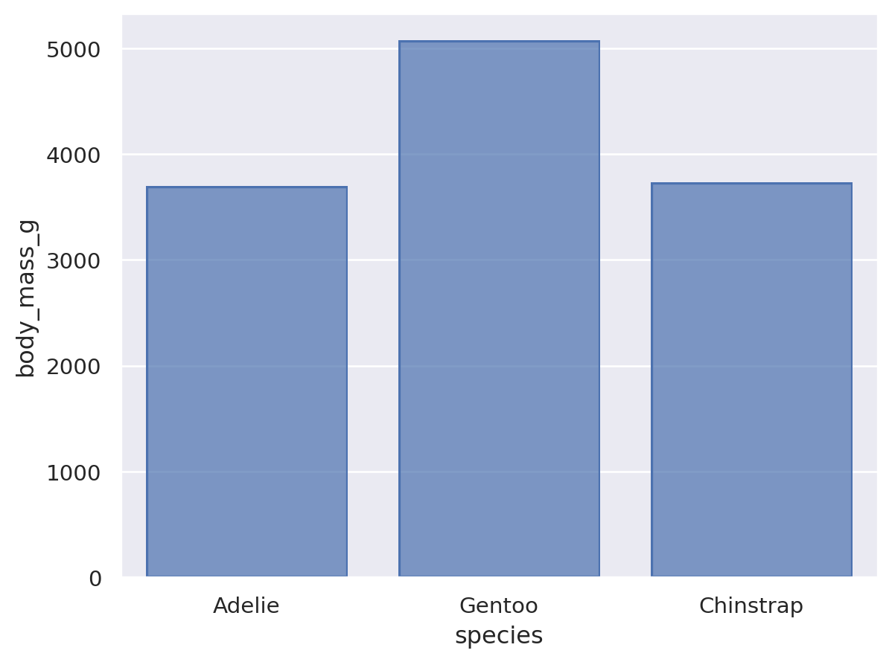

# HW 1 - CS 625, Fall 2023

Gopi Oddiraju  
Due: September 6, 2023

## Git, GitHub

*What is the URL of the GitHub repo that you created in your personal account?*

https://github.com/GopiOddiraju/gopioddiraju.github.io
   
*In which direction does the 'pull' command work (send local changes to remote OR send remote changes to local)?*

remote to local
   
*If you have committed a change on your local machine, but do not see the update on GitHub.com, what step might have you forgotten?*

Pushing into GitHub after committing the changes.

## Markdown

*Create a bulleted list with at least 3 items*
* First
* Second
* Third

*Write a single paragraph that demonstrates the use of italics, bold, bold italics, and code, and includes a link. The paragraph does not have to make sense.*

*This paragraph explains the use of italics* and **this is the first time I'm using Github actually, though I've created an account long ago.** ***So, please bear with my silly mistakes for some days.***, `Hopefully I'll get better at it`, and this is how we can insert a [link](https://www.tableau.com/)

*Create a level 3 heading*
### A level 3 heading

*Insert an image of an animal, sized appropriately*

## Tableau

*Insert your the image of your final bar chart here. Reminder, this should show data from a region other than the South.*

## Google Colab

*What is the URL of your Google Colab notebook?*

https://colab.research.google.com/drive/1A9k19TiZnX7DNZaq7bA8Bxp1QjH5d71l#scrollTo=JVXnTqyE9RET

## Python/Seaborn

*Insert the first penguin chart here*

*Describe what the figure is showing.*

This figure shows the comparison of bill length and bill depth of all species in mm.

*Insert the second penguin chart here*

*Describe what the figure is showing.*

This figure shows the sum of body mass for each kind of species using the aggregate function sum.

*What happened when you removed the outer parentheses from the code? Why?*

There was a syntax error when I removed the outer parentheses from the code. From what I've understood, To break up long lines of code, using parentheses is an option. As we removed them now in this code, there was an error. We can avoid that by modifying the code to `so.Plot(penguins, x="species", y="body_mass_g").add(so.Bar(), so.Agg())`.

## Observable and Vega-Lite

*What happens when you replace `markCircle()` with `markSquare()`?*

All the data points were represented by Squares instead of circles.

*What happens when you replace `markCircle()` with `markPoint()`?*

All the data points were represented by Points instead of circles.

*What change do you need to make to swap the x and y axes on the scatterplot?*

We need to interchange the field names such as the Miles_per_Gallon field for x and the Horsepower field for y.

*Insert the bar chart image here*

*Why do you think this chart is the result of this code change?*

As we removed the country of origin, the total count appears in a single bar.

## References

*Every report must list the references (including the URL) that you consulted while completing the assignment. Replace the items below with the references you consulted*

* Reference 1, <https://www.markdownguide.org/basic-syntax#emphasis>
* Reference 2, <https://github.com/adam-p/markdown-here/wiki/Markdown-Cheatsheet>
