# HW 2 - CS 625, Fall 2023

Gopi Oddiraju  
Due: September 20, 2023

### Part 1. Data Cleaning

Created a new project in OpenRefine using PetNames.tsv dataset as shown below.

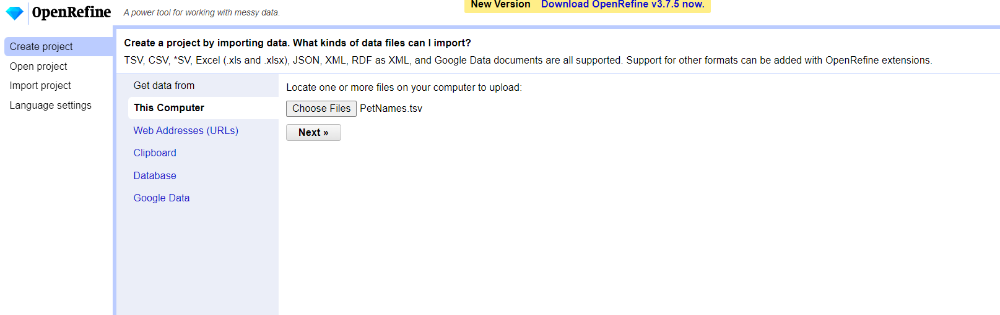

Cleared leading and trailing white spaces in all cells in all columns using Edit cells > Common transforms > trim leading and trailing spaces option.

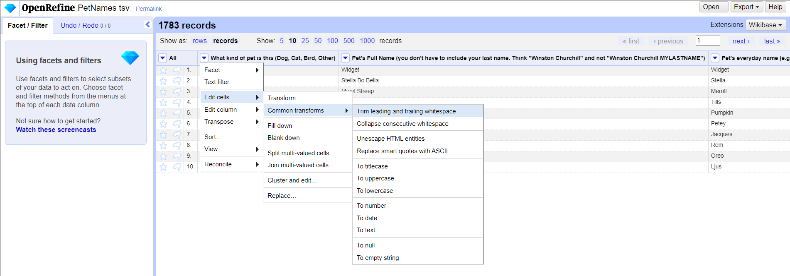

Renamed the columns with appropriate names using the edit column> rename column option.

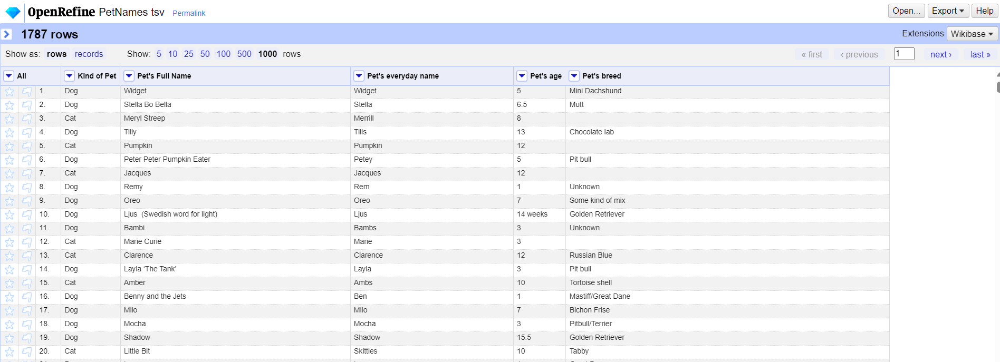

#### Kind of Pet Column
Created a text facet for "Kind of Pet" column. Using the cluster option, merged each kind of species with different names into one (used different methods along with different keying functions.). There were 69 different kinds of pets at first. 

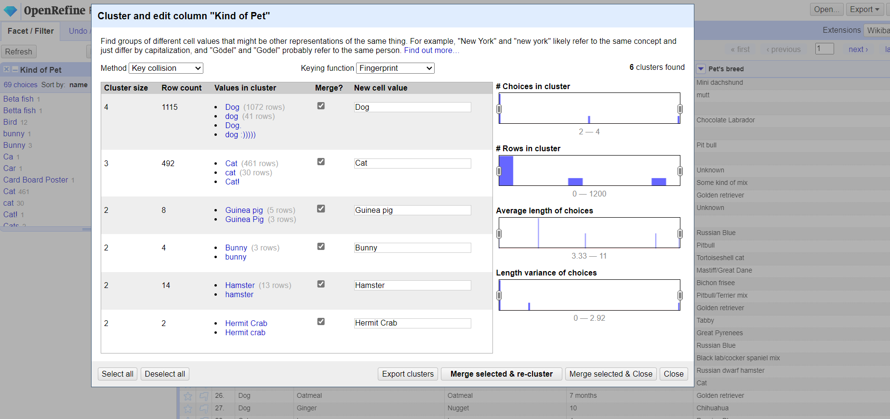

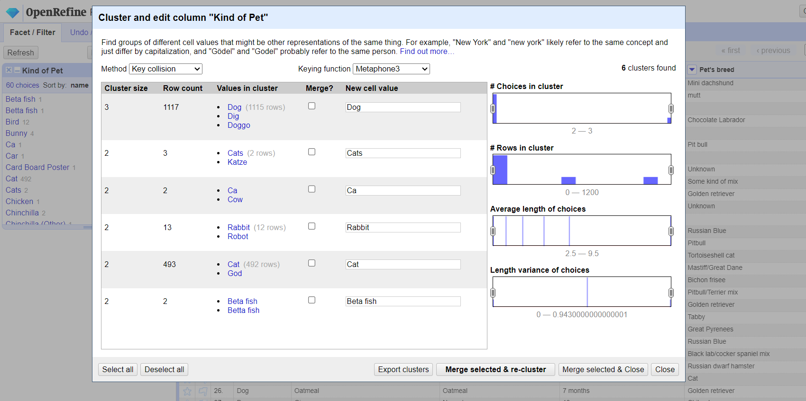

Manually corrected a few of them which could not be done using the cluster option. ex: God as Dog, Car as Cat, Dlg as Dog, Sog as Dog. (By selecting the type and clicking on the edit option). Identified a few blank fields as Dogs based on their breed. Changed a few others based on my knowledge ( Bunny as Rabbit, beta fish as fish). There was a row with the value "dog, dog, dog, cat". Using split muti-valued cells options ("," as separator), divided into multiple records as below.

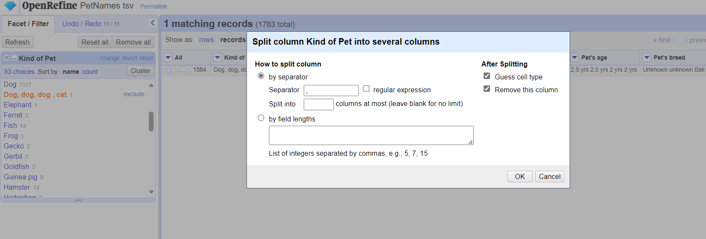

After making all these changes, finally, there are 30 different kinds of pets left including blank as a type. ( Kept Human, Virus as it is). 

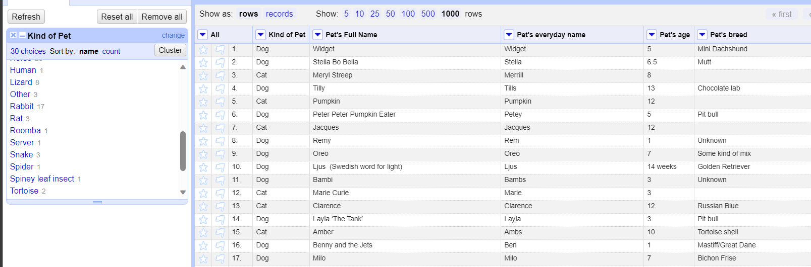

#### Pet's full name column
Then, I moved on to the Pet's full name column. Applied a text facet and used clusters with different types of keying functions. 

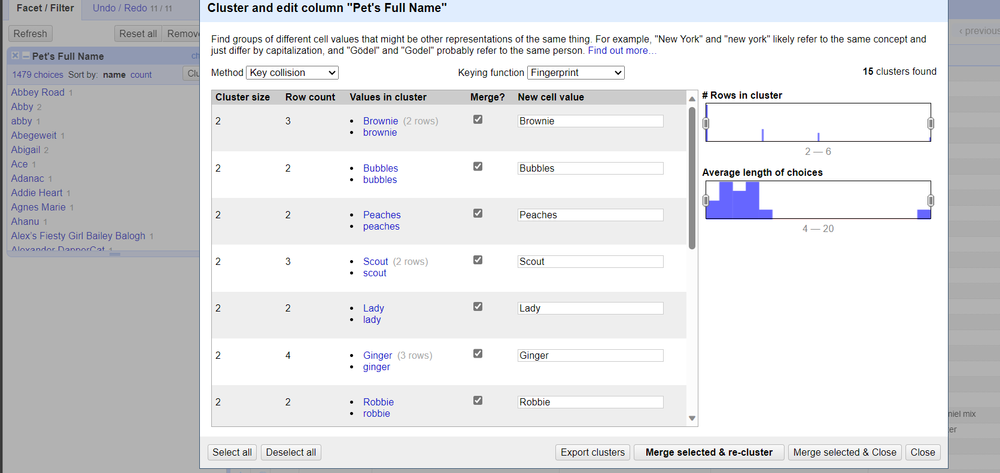

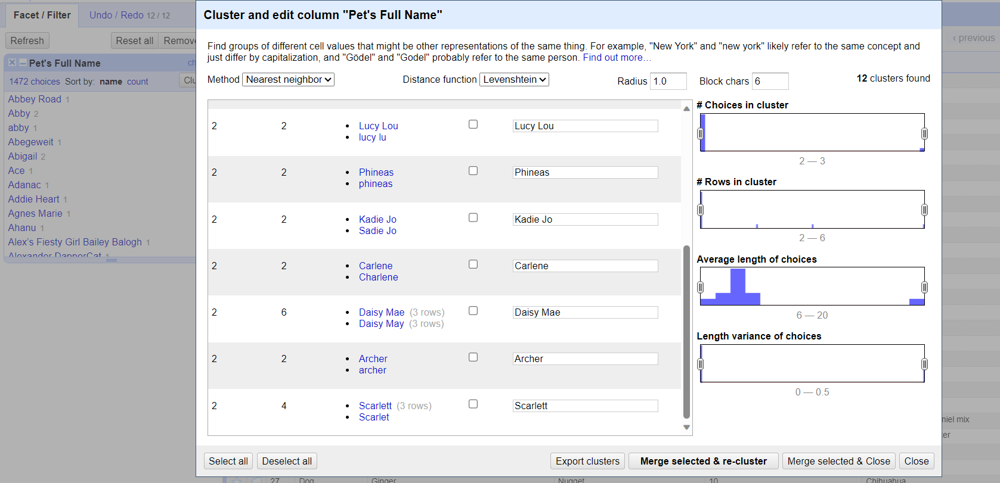

As Names are Nouns, I kept most of them as it is ( for eg: I considered Scarlett and Scarlet as different names. ) Used clusters mostly for removing case sensitivity and merged them.

#### Pet's everyday name column

I followed the same procedure for this as Pet's full name column.

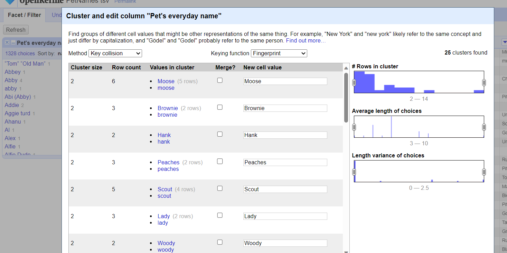

#### Pet's Age column

There were a lot of inconsistencies in this column's data format. At first, created a text facet and found out that there are 204 different choices.

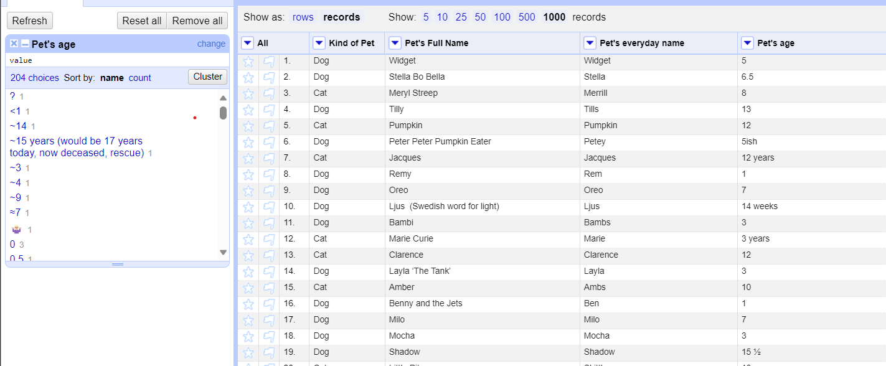

Using value.replace("~", "") expression removed approximations. Here, selected only one record for the purpose of screenshot and made changes at all places.
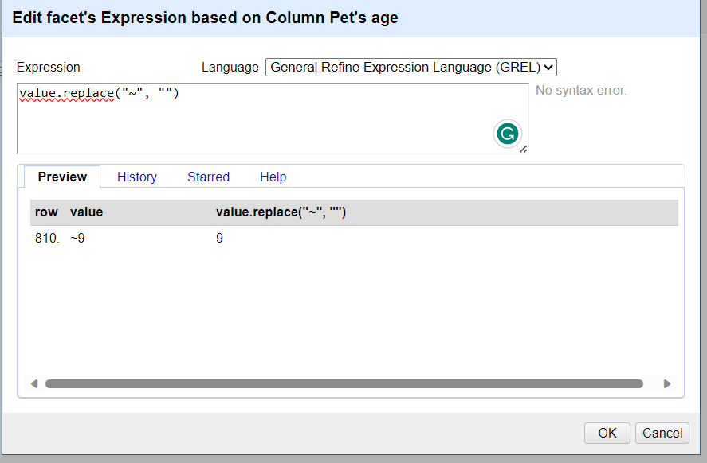

Removed non-numeric values using the below expressions. Kept Deceased as deceased even when the age was known. Blanks and some symbols were considered Unknown.

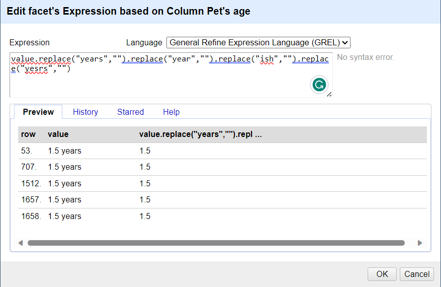

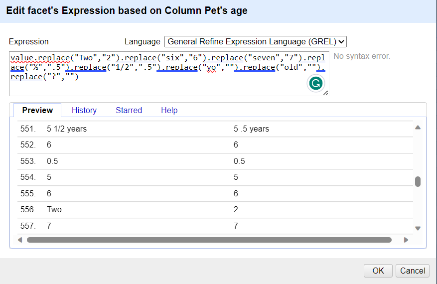

Converted months/weeks into years. Changed the column datatype from text to Number.

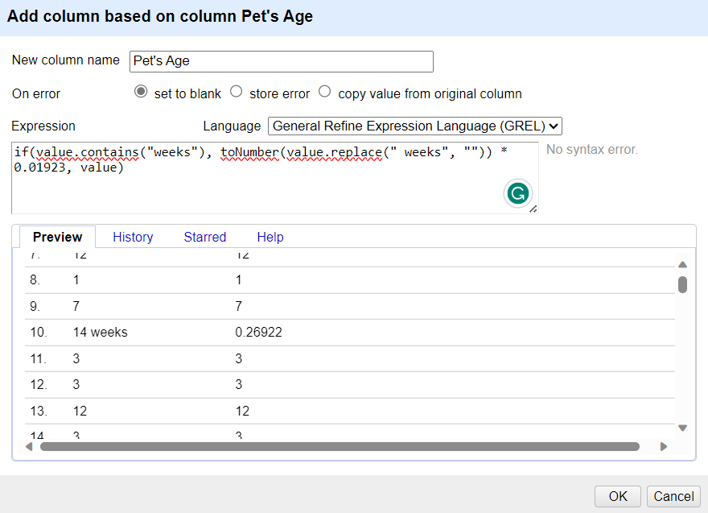

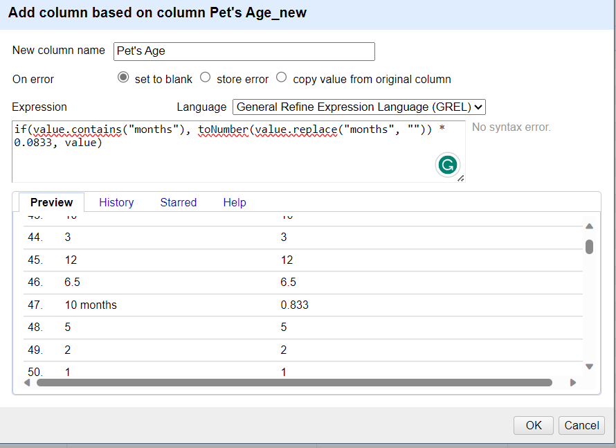

#### Pet's breed column

Followed the same steps such as removing leading and trailing spaces, and merging the same kind of breeds into one using clusters. 

### Part 2. Analyze Cleaned Data

1. How many types (kinds) of pets are there?

   There are 30 kinds of Pets. We can see that by creating a text facet to the kind of pet column.

   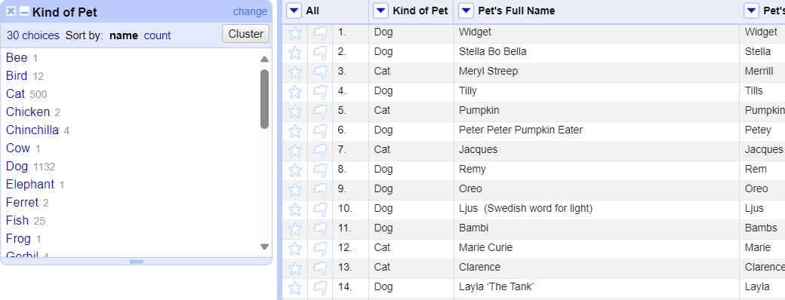

1. How many cats?

   500 Cats. We can see the number beside the type of pet.
   
1. How many breeds of cats?

   91 types. We can find out that by applying text facets to both the kind of pet and pet breed columns and selecting the cat. Then we can the total number of choices as shown below.

   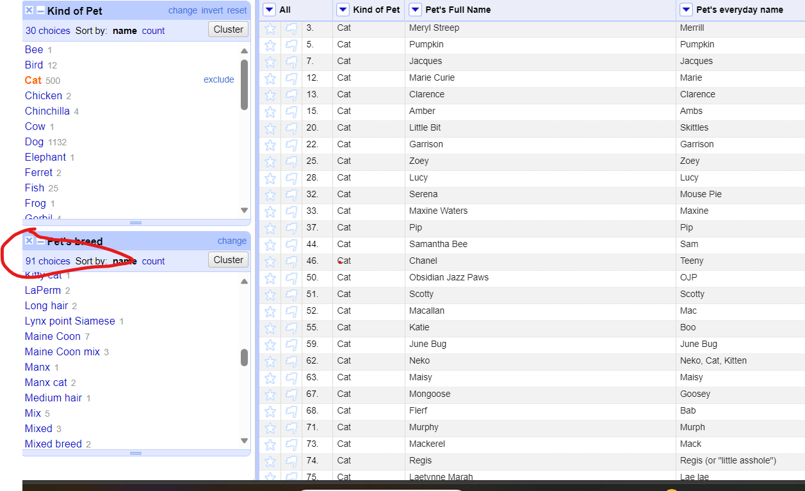

   
1. What's the most popular cat breed? How many cats are in that breed?

   **Domestic short-hair** breed. There are 69 such cats. We can find out by sorting them based on the count.

   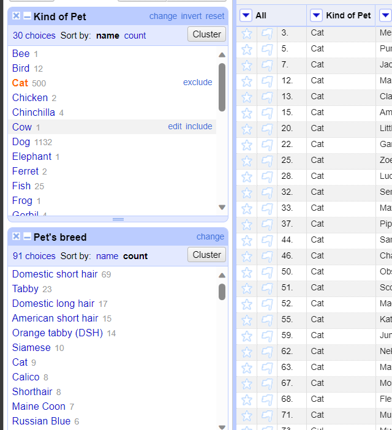

1. What's the age range of the cats?

   The age range of cats is from 0.1 years to 24 years. This can be found out by sorting the pet's age column after filtering the type of pet to the cat.

   
1. What's the age range of the rabbits? (*Don't forget to look for the bunny, too.*)

   The age range of cats is from 1.75 years to 13 years. This can be found out by sorting the pet's age column after filtering the type of pet to Rabbit( I already changed Bunnys to Rabbit).
   
1. What is the oldest pet? Give the pet's name, kind, and age.

   The oldest pet is a cat. The pet's full name is **Bruce Springsteen** and the pet's breed as per the given data is a cat, Its age is 24.

   
1. What are the top 5 most popular dog breeds? List the breed and number.

   The top 5 most popular dog breeds are **Golder Retriever**, **Mutt**, **Labrador Retriever**, **Border Collie**, **German Shepherd**. Apply text facets to the kind of pet and pet breed columns then select the dog in the kind of pet text facet, sort the pet breed facet by the count, and look for the first 5 breeds.

   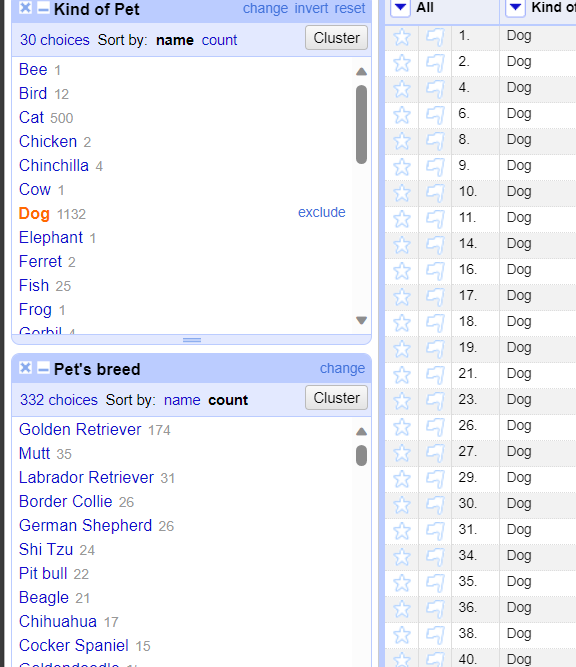

1. What's the most popular everyday name for a dog?

   **Daisy** is the most popular everyday name for a dog. Apply text facets to the kind of pet and pet's everyday name columns, select the dog in the kind of pet facet, and then sort the most popular everyday name facet by the count.

   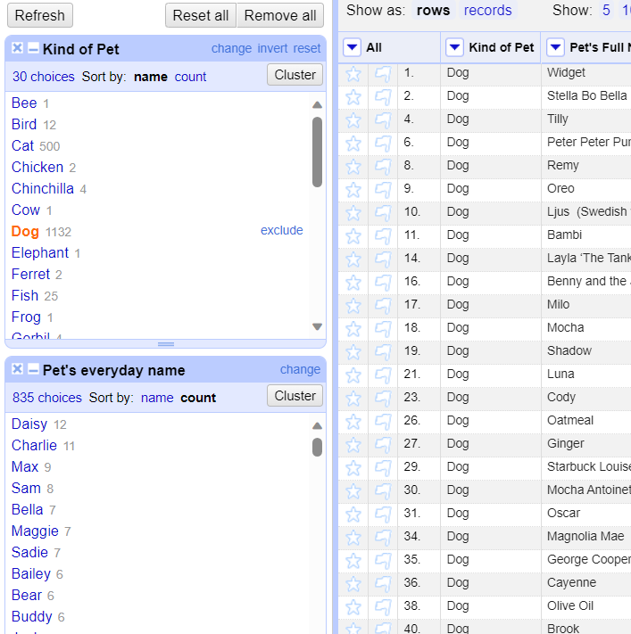

   
1. What's the most popular full name any pet?

   **Sophie** is the most popular full name for any pet. Apply text facet to the pet's full name column. Sort it by the count.

   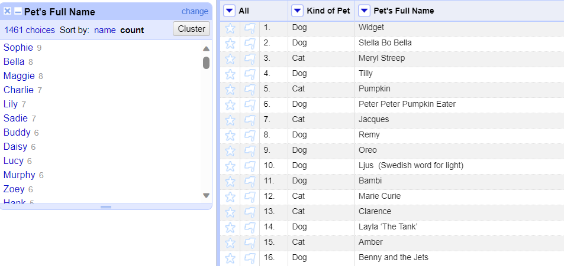

## References

https://www.youtube.com/watch?v=B70J_H_zAWM&list=PL737054C67FCC0741

https://vickysteeves.gitlab.io/2018-uutah-repro/cleaning-data.html

