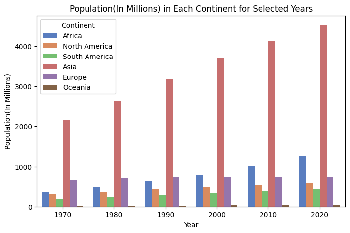
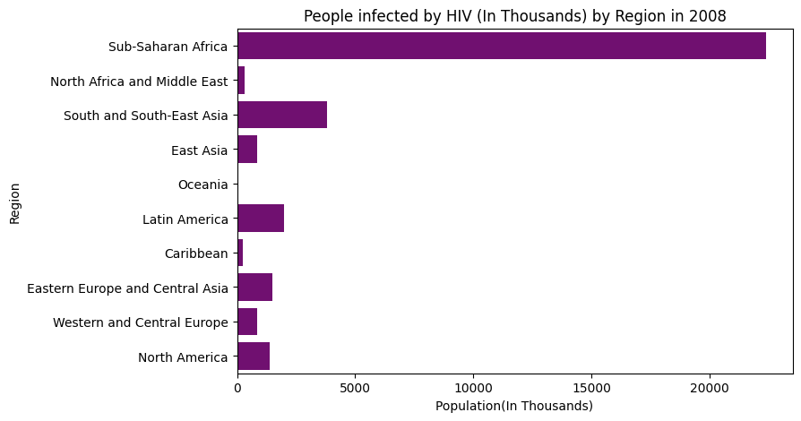
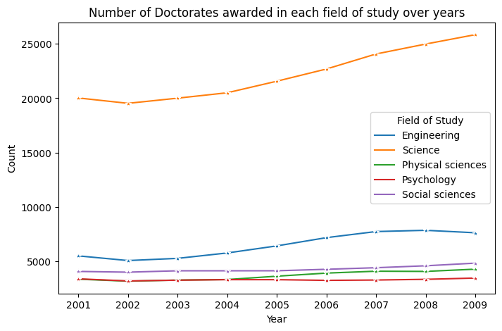
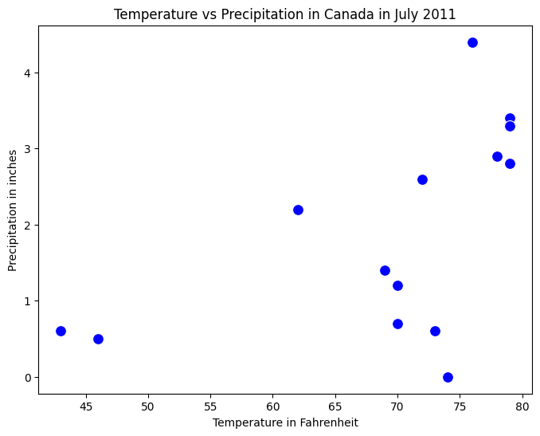
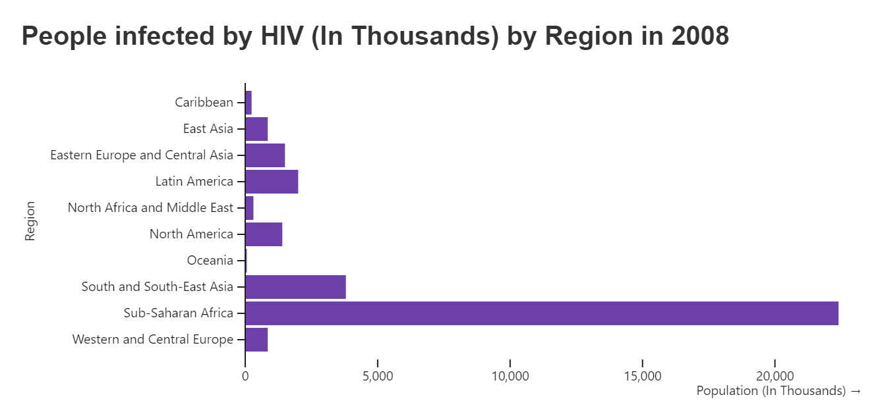

# HW 3 - CS 625, Fall 2023

Gopi Oddiraju  
Due: October 06, 2023

## BarChart

### Data
I have taken a simple dataset that shows the population of each continent from 1970 to 2020, from Table 1330 of section 30-International Statistics.
https://www.census.gov/library/publications/2011/compendia/statab/131ed/international-statistics.html

I have manipulated the given data to some extent for convenience. At first, I removed the header and footnotes. I removed the percent distribution data and considered the population from the years 1970 to 2020 only as too many categories would congest the bars. After that, I made a few other minor changes such as renaming columns and formatting the cells. Finally, I saved the file as a CSV format. Both the Original(12s1330.xls) and modified files(12s1330.csv) have been uploaded to this repository. I have read the data from CSV and as data frames using Seaborn. The collab link is provided below.

https://colab.research.google.com/drive/1FZ_0ADzYHshpLJ4VkfvonXmiAMMJws3z?pli=1&authuser=1#scrollTo=1MQzd1-cWXpI

### Visualization Idiom
Idiom: Bar Chart / Mark: Bar
| Data: Attribute | Data: Attribute Type  | Encode: Channel | 
| --- |---| --- |
| Year | key, Ordinal | horizontal position on a common scale (x-axis) |
| Continent | key, categorical | Hue (differentiating multiple positions) |
| Population | value, quantitative | vertical spatial region (y-axis) |

A multiple bar chart is better suited for this type of data as it allows for a clear comparison of population across different regions over multiple years which we cannot do with a single bar chart.

I found this data first, so I've chosen this. I've created a regular single bar chart as well (Thought that a multiple bar chart was not what you expected)

## BarChart

### Data
I've chosen a dataset that provides information about the number of people infected by HIV by region in 2008. It is taken from Table 1341 of Section 30-International Statistics.

https://www.census.gov/library/publications/2011/compendia/statab/131ed/international-statistics.html

I considered only living people with HIV and removed the remaining three categories as I've planned to plot a single bar chart this time. Both original(12s1341.xls) and processed(12s1341.csv) files have been uploaded to this repository. The collab link is provided below.

https://colab.research.google.com/drive/1FZ_0ADzYHshpLJ4VkfvonXmiAMMJws3z?pli=1&authuser=1#scrollTo=1MQzd1-cWXpI

### Visualization Idiom
Idiom: Bar Chart / Mark: Bar
| Data: Attribute | Data: Attribute Type  | Encode: Channel | 
| --- |---| --- |
| Population | value, Quantitative | horizontal spatial region (x-axis) |
| Region | key, categorical | vertical position on a common scale (y-axis) |

A Bar chart is suitable for this data because it effectively represents the population of different regions. The length of each bar represents the population size, allowing for an easy visual comparison.

## MultipleLineChart

### Data
I have taken a dataset that provides information about the number of Doctorates awarded in different fields of study over the years 2001 to 2009, from Table 815 of section 16-Science and Technology.
(https://www.census.gov/library/publications/2011/compendia/statab/131ed/science-technology.html)

The data is available from 1996 to 2009. For the sake of a multiple-line chart, I considered only from 2001 to 2009. I have manipulated the given data by eliminating the subcategories in each field as I'm trying to plot a multiple-line chart and I thought not more than 4/5 categories would be a good choice. Similar to the above datasets, I removed the header and footnotes. I made a few other minor changes such as renaming columns and formatting the cells. Finally, I saved the file as a CSV format. Both the Original(12s0815.xls) and modified files(12s0815.csv) have been uploaded to this repository. I have read the data from CSV and as data frames. The collab link is provided below.

https://colab.research.google.com/drive/1FZ_0ADzYHshpLJ4VkfvonXmiAMMJws3z?pli=1&authuser=1#scrollTo=1MQzd1-cWXpI

### Visualization Idiom

Idiom: Multiple Line Chart / Mark: Point
| Data: Attribute | Data: Attribute Type  | Encode: Channel | 
| --- |---| --- |
| Year | key, Ordinal | horizontal position on a common scale (x-axis) |
| Field of Study | key, categorical | Hue (differentiating multiple fields) |
| Count | value, quantitative | vertical position on a common scale (y-axis) |

A Multiple line chart is suitable for this data as it can represent the trends and patterns over time for different fields of study. This type of visualization is effective for showing relative comparison.

## ScatterPlot

### Data
I have taken a dataset that provides information about the average temperature(in Fahrenheit) and precipitation(in inches) in the months of January and July in various cities in 2011. I filtered all the cities in Canada and removed all remaining records otherwise there would be too many points on the scatterplot. I considered only July's records and ignored January's. Both the Original(12s1390.xls) and processed files(12s1390.csv) have been uploaded to this repository. I have read the data from CSV and as data frames. The dataset is taken from Table 1390 of Section 30-International Statistics.

https://www.census.gov/library/publications/2011/compendia/statab/131ed/international-statistics.html

The collab link is provided below.

https://colab.research.google.com/drive/1FZ_0ADzYHshpLJ4VkfvonXmiAMMJws3z?pli=1&authuser=1#scrollTo=1MQzd1-cWXpI

### Visualization Idiom

Idiom: Scatter Plot / Mark: Point
| Data: Attribute | Data: Attribute Type  | Encode: Channel | 
| --- |---| --- |
| Temperature | value, quantitative | horizontal position on a common scale (x-axis) |
| Precipitation | value, quantitative | vertical position on a common scale (y-axis) |
| City | key, categorical | Hue (Differentiating multiple cities) |

A Scatter plot is a suitable visualization for this type of data as can plot a graph between two quantitative attributes. Doing so will help us in finding any correlation between both of them. In this case, We can find out if temperature is affecting the precipitation in any way. 

## BarChart using VegaLite

### Data
I have used the same data(HIV data) which was used for creating a single bar chart.

### Visualization Idiom
Idiom: Bar Chart / Mark: Bar
| Data: Attribute | Data: Attribute Type  | Encode: Channel | 
| --- |---| --- |
| Population | value, Quantitative | horizontal spatial region (x-axis) |
| Region | key, categorical | vertical position on a common scale (y-axis) |

The link to the Observable notebook is provided below.

https://observablehq.com/d/c74ea312c7402bc0

After creating the same chart using two different tools, I felt that creating it using VegaLite is much easier and does not require any coding knowledge. It took some time for me to understand VegaLite as I did not use it much apart from HW1. When it comes to customization, I still feel Seaborn/Python is better as I could not find many options in VegaLite (Or I guess I have not explored enough). I was confused about the tools CS students are allowed to use for this HW. I believe we can only use Seaborn and VegaLite. If not, I can recreate any of these with either Tableau or Excel.

## References

https://www.cs.ubc.ca/~tmm/talks/vad/vadallslides-2021.pdf#page=140

https://observablehq.com/@oducs-vis/marks-and-channels-with-vega-lite

https://observablehq.com/@uwdata/introduction-to-vega-lite

https://www.census.gov/library/publications/2011/compendia/statab/131ed/births-deaths-marriages-divorces.html

