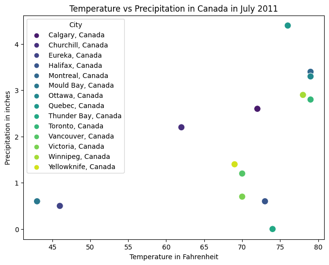

# HW 3 - CS 625, Fall 2023

Gopi Oddiraju  
Due: October 06, 2023

## BarChart

### Data
I have taken a simple dataset that shows the population of each continent from 1970 to 2020, from table 1330 of section 30-International Statistics.
https://www.census.gov/library/publications/2011/compendia/statab/131ed/international-statistics.html

I have manipulated the given data to some extent for convenience. At first, I removed the header and footnotes. I removed the percent distribution data and considered the population from the years 1970 to 2020 only as too many categories would congest the bars. After that, I made a few other minor changes such as renaming columns and formatting the cells. Finally, I saved the file as a CSV format. Both the Original(12s1330.xls) and modified files(12s1330.csv) have been uploaded to this repository. I have read the data from csv and as dataframes. The collab link is provided below.

https://colab.research.google.com/drive/1FZ_0ADzYHshpLJ4VkfvonXmiAMMJws3z?pli=1&authuser=1#scrollTo=1MQzd1-cWXpI

### Visualization Idiom
Idiom: Bar Chart / Mark: Bar
| Data: Attribute | Data: Attribute Type  | Encode: Channel | 
| --- |---| --- |
| Year | key, Ordinal | horizontal position on a common scale (x-axis) |
| Continent | key, categorical | Hue (differentiating multiple positions) |
| Population | value, quantitative | vertical spatial region (y-axis) |

I found this data first, so I've choosen this. I've created a regular single bar chart as well (Thought that a multipe bar chart is not what you expected)

## BarChart

### Data
I've chosen a dataset which provides information about the number of people infected by the HIV by region in 2008. It is taken from the table 1341 of section 30-International Statistics.

https://www.census.gov/library/publications/2011/compendia/statab/131ed/international-statistics.html

I considered only living people with HIV and removed remianing three categories as I've planned to plot a single bar chart this time. Both original(12s1341.xls) and processed(12s1341.csv) files have been uploaded to this repository.

https://colab.research.google.com/drive/1FZ_0ADzYHshpLJ4VkfvonXmiAMMJws3z?pli=1&authuser=1#scrollTo=1MQzd1-cWXpI

### Visualization Idiom
Idiom: Bar Chart / Mark: Bar
| Data: Attribute | Data: Attribute Type  | Encode: Channel | 
| --- |---| --- |
| Population | value, Quantitative | horizontal spatial region (x-axis) |
| Region | key, categorical | vertical position on a common scale (y-axis) |

## MultipleLineChart

### Data
I have taken a dataset that provides information about the number of Doctorates awarded in different fields of study over the years 2001 to 2009, from Table 815 of section 16-Science and Technology.
(https://www.census.gov/library/publications/2011/compendia/statab/131ed/science-technology.html)

The data is available from 1996 to 2009. For the sake of multiple line chart, I considered only from 2001 to 2009. I have manipulated the given data by eliminating the sub categories in each field as I'm trying to plot a multiple line chart and I thought not more than 4/5 categories would be a good choice. Similar to the above datasets, I removed the header and footnotes. I made a few other minor changes such as renaming columns and formatting the cells. Finally, I saved the file as a CSV format. Both the Original(12s0815.xls) and modified files(12s0815.csv) have been uploaded to this repository. I have read the data from csv and as dataframes. The collab link is provided below.

https://colab.research.google.com/drive/1FZ_0ADzYHshpLJ4VkfvonXmiAMMJws3z?pli=1&authuser=1#scrollTo=1MQzd1-cWXpI

### Visualization Idiom

Explain why this is appropriate for this data
Idiom: Mutiple Line Chart / Mark: Point
| Data: Attribute | Data: Attribute Type  | Encode: Channel | 
| --- |---| --- |
| Year | key, Ordinal | horizontal position on a common scale (x-axis) |
| Field of Study | key, categorical | Hue (differentiating multiple fields) |
| Count | value, quantitative | vertical position on a common scale (y-axis) |

## ScatterPlot

### Data
I have taken a dataset that provides information about the average temperature(in Fahrenheit) and precipitation(in inches) in the months of January and July in various cities in 2011. I filtered all the cities in Canada and removed all remianining records otherwise there would too many points on the scatterplot. I considered only January's records and ignored July's. Both the Original(12s1390.xls) and processed files(12s1390.csv) have been uploaded to this repository. I have read the data from csv and as dataframes. The dataset is taken from the table 1390 of section 30-International Statistics.

https://www.census.gov/library/publications/2011/compendia/statab/131ed/international-statistics.html

The collab link is provided below.

https://colab.research.google.com/drive/1FZ_0ADzYHshpLJ4VkfvonXmiAMMJws3z?pli=1&authuser=1#scrollTo=1MQzd1-cWXpI

### Visualization Idiom

Explain why this is appropriate for this data
Idiom: Scatter Plot / Mark: Point
| Data: Attribute | Data: Attribute Type  | Encode: Channel | 
| --- |---| --- |
| Temperature | value, quantitative | horizontal position on a common scale (x-axis) |
| Precipitation | value, quantitative | vertical position on a common scale (y-axis) |

