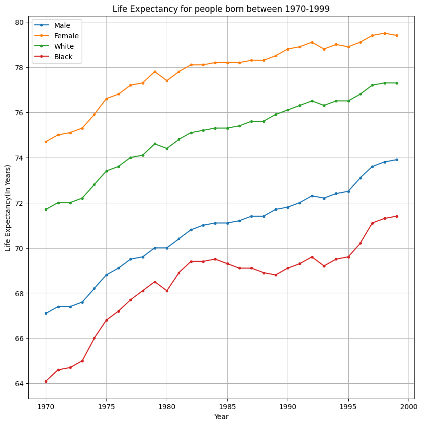

# HW 4 - CS 625, Fall 2023

Gopi Oddiraju  
Due: October 27, 2023

I've chosen dataset 2 for this Homework. I have manipulated the given data to some extent for convenience. At first, I removed the header and footnotes. I deleted the rows that showed the deaths for the U.S., Puerto Rico, Virgin Islands, Guam, American Samoa, and Northern Marianas. I've created two new columns; '**Deaths due to diseases**' and '**Deaths due to Accidents, Injury, Assault**'. I entered the total number of deaths from all diseases into the newly formed column 'Deaths due to Diseases'. Similarly, I added values from the columns 'Total Accidents', 'Injury by firearms', 'Intentional self-harm', and 'Assault (Homicide)' to the column 'Deaths due to Accidents, Injury by firearms, Assault'. Though the dataset says these are death rates, as mentioned in the notes, these were age-adjusted rates per 100,000 population, we can add them directly. After that, I made a few other minor changes such as formatting the cells. Finally, I saved the file as a CSV format. Both the Original(10s0118.xls) and modified files(10s0118.csv) have been uploaded to this repository. I have read the data from CSV and as data frames using Seaborn. The collab link is provided below. The ipynb file has also been uploaded to the repository.

## Q1:

### Question: Which states had the highest death rates over all causes in 2006?

https://colab.research.google.com/drive/1bjCUKy2nAgOTzdkuqQtH39Iq7PtRrneO#scrollTo=TZBK_qry14H5

Plotting a bar chart between the states and death rates over all causes helps to find out which states had the highest death rates over all causes in 2006. I believe a bar chart is more suitable to answer this question than other options because It is effective for comparing the deaths across different states. each bar represents a state, and the length of the bar corresponds to the deaths allowing for a clear visual comparison. Bar charts are easy and simple to understand. A bar chart based on sorted values would provide more clear insights as well. I've considered a horizontal bar chart in this case to accommodate longer category names and for better readability.

### Idiom: Bar Chart / Mark: Bar
| Data: Attribute | Data: Attribute Type  | Encode: Channel | 
| --- |---| --- |
| Death rate | value, Quantitative | horizontal spatial region (x-axis) |
| State | key, categorical | vertical position on a common scale (y-axis) |

I decided to plot a horizontal bar chart for better readability. I've plotted the bar chart using the data sorted by total death rates over all causes so that we can easily compare among states. Death rates were represented on X-axis and the states were represented using Y-axis. I've decreased the font size for the label on the y-axis to make sure the states' names do not overlap with each other. 

To answer question 1, Top 5 five states with the highest death rates in 2006 were Mississippi, Alabama, West Virginia, Louisiana, and Oklahoma. The lowest death rates were observed in the states of Hawaii, Minnesota, California, New York, and Utah with Hawaii being the lowest.

## Q2:

### Question: Is this ordering different if you compare deaths due to disease vs. deaths due to accident, injury, and assault? In other words, which states are more hazardous to your health vs. which states are the most dangerous?

https://colab.research.google.com/drive/1bjCUKy2nAgOTzdkuqQtH39Iq7PtRrneO#scrollTo=TZBK_qry14H5

Plotting a diverging bar chart would be the best option to answer this question. At first, I considered stacked bar charts and multiple bar charts. However, I preferred a diverging bar chart because it makes comparing the death rates due to both causes easier. A multiple bar chart can compare as well but it will take a lot of space for 50 states and may look congested. Then, I've had a look at subplots where we will have two separate bar charts for each cause. But, I believe we need to plot a single chart to represent this. After considering all factors, I thought a diverging bar chart was the best option, as we can plot both causes on either side of the one axis and we can represent the states on the other axis. I've considered a horizontal bar chart in this case to accommodate longer category names and for better readability.

### Idiom: Diverging Bar Chart / Mark: Bar
| Data: Attribute | Data: Attribute Type  | Encode: Channel | 
| --- |---| --- |
| Death rate | value, Quantitative | horizontal spatial region (x-axis) |
| State | key, categorical | vertical position on a common scale (y-axis) |
| Death cause | key, categorical | Hue (differentiating multiple causes) |

I've plotted the diverging bar chart using the data sorted by total death rates due to Accidents, Injury by firearms, and Assault as these values were very close to each other in all the states and can be compared easily when sorted. Death rates were represented on the X-axis and States were represented on the Y-axis. Death rates due to Diseases were represented using the purple bars and Death rates due to Accidents, Injury by firearms, Assault were represented using green bars. I've changed the axis labels. To be able to identify the values easily, I've made the value of each bar appear next to the bar. 

To answer question 2, Yes, The ordering is different when I compared the death rates due to Diseases and Death rates due to Accidents, Injuries by firearms, and Assault from the ordering when compared the death rates over all causes. However, Mississippi remains at the top when considering all causes and when considering only Diseases. When we consider the death rates due to Accidents, Injury by firearms, and Assault, the top 5 states were New Mexico, Mississippi, Louisiana, Wyoming, and Alaska and the states with the lowest death rates were New York, Massachusetts, Hawaii, New Jersey, and Connecticut with New York being the lowest. When we consider the death rates due to Diseases, the top 5 states were Mississippi, Alabama, Oklahoma, Kentucky, and Louisiana and the states with the lowest death rates were Hawaii, Utah, Minnesota, Colorado, and Arizona with Utah being the lowest.

Even after considering the death rates due to only Diseases instead of all causes, The states Mississippi, Alabama, Oklahoma, and Louisiana were found to be in the top 5. It seems these states along with Kentucky are more hazardous to our health. Similarly, when considering death rates due to only Accidents, Injury by firearms, and Assault, The states of Mississippi, and Louisiana were found at the top along with New Mexico, Wyoming, and Alaska. These states are more crime-prone and dangerous.

## Further questions:

Question: What are the specific factors contributing to higher death rates in states like Mississippi, Alabama, Oklahoma, and Louisiana? 
Hypothesis: It might be influenced by access to quality healthcare and socioeconomic challenges in these states.

Question: Are there regional patterns of states with similar health and safety profiles?
Hypothesis: There might be similar health and safety challenges due to shared geographical factors.

Question: Have there been any public health policies in states with lower death rates that can be used in other states?
Hypothesis: States with lower death rates might have implemented effective healthcare policies.

Question: Are the states with higher death rates due to crime, lacking enough education and employment opportunities? 
Hypothesis: Lack of educational awareness and employment opportunities might have increased the crime rates in this case.

## Extra Credit 2:

I've completed the whole assignment using the 3rd dataset. I have manipulated the given data to some extent for convenience. At first, I removed the header and footnotes. I deleted all rows except from 1970 to 1999. I've removed the columns 'Total' from the Total section,  'Male' and 'Female' from the White section, and 'Male' and 'Female' from the Black section. I renamed the columns for convenience. After that, I made a few other minor changes such as formatting the cells. Finally, I saved the file as a CSV format. Both the Original(10s0102.xls) and modified files(10s0102.csv) have been uploaded to this repository. I have read the data from CSV and as data frames using Seaborn. The collab link is provided below.

## Q1

### Question: Using Table 102, compare life expectancy for people born between 1970-1999 for the four categories, "Male", "Female", "White", and "Black".

https://colab.research.google.com/drive/1bjCUKy2nAgOTzdkuqQtH39Iq7PtRrneO#scrollTo=TZBK_qry14H5

A multiple-line chart is the best option to compare trends over time. It allows a clear and direct comparison. It deals with the time series data, and a line chart is effective in explaining the changes in life expectancy over the years. Line charts create a continuous visual representation of the data. As we are comparing the life expectancy for four categories, I've chosen a multiple-line chart instead of a single-line chart. The year is represented on the X-axis. Life expectancy in years is represented on the Y-axis. Each category is represented by each color.

### Idiom: Multiple Line Chart / Mark: Point
| Data: Attribute | Data: Attribute Type  | Encode: Channel | 
| --- |---| --- |
| Year | Key, Ordinal | horizontal spatial region (x-axis) |
| Category | key, categorical | Hue (differentiating multiple categories)  |
| Life expectancy | value, quantitative | vertical position on a common scale (y-axis) |

I've considered an appropriate size for the chart. I've plotted the year on the X-axis and life expectancy on the Y-axis, and each category is represented with a different color. I kept an appropriate label for the axes and a clear title for the chart and included a legend to differentiate among the colors. I made sure that the grid appeared in the background to be able to identify the values easily and represented each data point with a 'point'. 

To answer question 1, The life expectancy for all four categories is getting better over time gradually except for a small decline in the years 1980 and 1993. Interestingly this is the same for all four categories. The life expectancy of black people is the lowest among the given categories while it is highest for Female people, and White and Male categories are at 2nd and 3rd place from the top. The growth of life expectancy for all categories has been linear. For black people, it starts at 64 years in 1970 and ends up at over 71 in 1999, whereas, for the male category, the lowest is 67 in 1970 and reached its highest at almost 74 in 1999. For white people, It was over 70 in 1970 and it became 77 in 1999, and 75 was the lowest and recorded in 1970 and ended up with a highest of 79 in 1999 for the female category.

## Q2

I have manipulated the given data for convenience. At first, I removed the header and footnotes. I've removed all other columns except the age less than 1-year column. There was data available for the Male category and the Female category separately. There was also separate data for White Male people, Black Male people, and as well as White Female people and Black female people. I considered the data available separately for Male and Female people for plotting respective categories( It has data only for the years 1980,1990, and 2000). For Black and White people, I considered the sum of white males, black males, and white females, black females respectively( It has data from 1980 to 1999 for every 5 years). I deleted all remaining rows. I've removed the columns with simple names. After that, I made a few other minor changes such as formatting the cells. Finally, I saved the file as a CSV format. Both the Original(10s0107.xls) and modified files(10s0107.csv) have been uploaded to this repository. I have read the data from CSV and as data frames using Seaborn. The collab link is provided below.

### Question: Using Table 107, compare infant mortality rates (under 1 year) for these same categories between 1980-1999.

https://colab.research.google.com/drive/1bjCUKy2nAgOTzdkuqQtH39Iq7PtRrneO#scrollTo=TZBK_qry14H5

A multiple-line chart is the best option to compare trends over time. It allows a clear and direct comparison. It deals with the time series data, and a line chart is effective in explaining the changes in life expectancy over the years. Line charts create a continuous visual representation of the data. As we are comparing the infant mortality rates for four categories, I've chosen a multiple-line chart instead of a single-line chart. The year is represented on the X-axis. infant mortality rate per 100,000 population is represented on the Y-axis. Each category is represented by each color.

### Idiom: Multiple Line Chart / Mark: Point
| Data: Attribute | Data: Attribute Type  | Encode: Channel | 
| --- |---| --- |
| Year | Key, Ordinal | horizontal spatial region (x-axis) |
| Category | key, categorical | Hue (differentiating multiple categories)  |
| Infant mortality rate | value, quantitative | vertical position on a common scale (y-axis) |

I've considered an appropriate size for the chart. I've plotted the year on the X-axis, the Infant mortality rate per 100,000 population on the Y-axis, and each category is represented with a different color. I kept an appropriate label for the axes and a clear title for the chart and included a legend to differentiate among the colors. I made sure that the grid appeared in the background to be able to identify the values easily and represented each data point with a 'point'.

To answer question 2, The infant mortality rate for females is the lowest among the given four categories. The highest is for the Black people category and White and Male categories were 2nd and 3rd from the top. For all categories, the mortality rate has been decreased gradually. For black people, there was a slight increase in the year 1996. Apart from that there is no upward graph for any of the given categories. For females, the mortality rate was around 1100 per 100,000 population in 1980 and it decreased to around 700 per 100,000 in 2000. For Males, it was 1400 in 1980 and it dropped to around 800 in 2000. The infant mortality rate for the white people was 2200 per 100,000 population in 1980 and gradually it became just over 1200 in 1999. Starting with over 4700 per 100,000 population, the infant mortality rate has decreased to 3100 in 1999 for black people.

## Further questions:

Question: What factors contributed to the common declines in life expectancy in the years 1980 and 1993 for all categories?
Hypothesis: Economic recession or any external factors such as wars or pandemics might have influenced life expectancy.

Question: What healthcare improvements helped the consistent growth in life expectancy over the years?
Hypothesis: Advances in healthcare, diet habits, or public health policies might have impacted positively.

Question: What factor might have caused the discrepancy among the four categories, with females having the highest life expectancy and blacks having the lowest?
Hypothesis: Socioeconomic factors and access to healthcare might have played a role in this.

Question: What healthcare improvements helped to the consistent decline in infant mortality rate over the years?
Hypothesis: Understanding the historical context and identifying the periods of deterioration can help future policy and healthcare initiatives.

Question: What factors contributed to the sudden increase in infant mortality rate in the year 1996 for black people?
Hypothesis: Economic challenges such as unemployment might have had an impact on this.

## References:
https://s3.amazonaws.com/assets.datacamp.com/blog_assets/Python_Seaborn_Cheat_Sheet.pdf

https://stackoverflow.com/questions/43214978/how-to-display-custom-values-on-a-bar-plot

https://www.geeksforgeeks.org/how-to-show-values-on-seaborn-barplot/

https://stackoverflow.com/questions/14399689/matplotlib-drawing-lines-between-points-ignoring-missing-data

