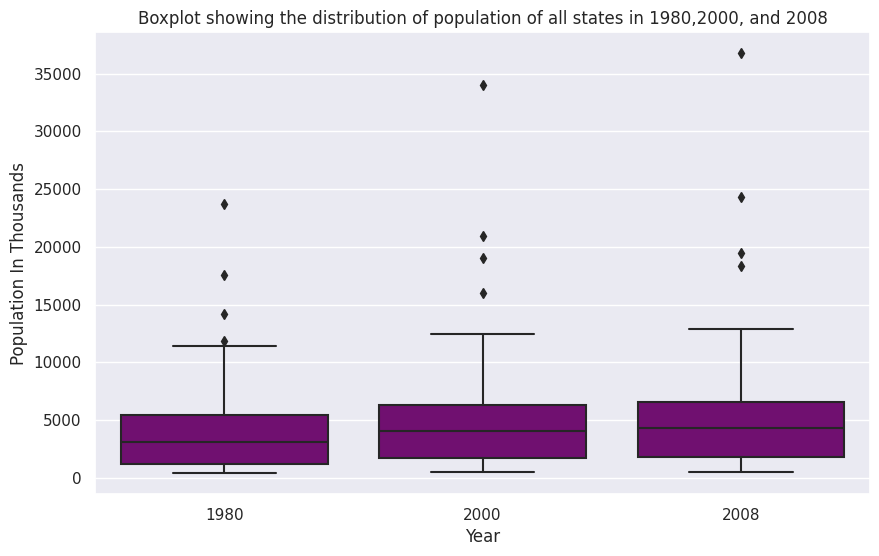
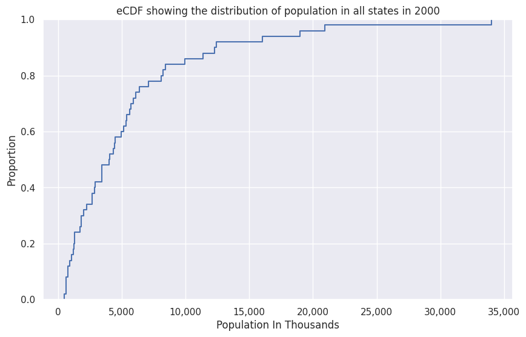
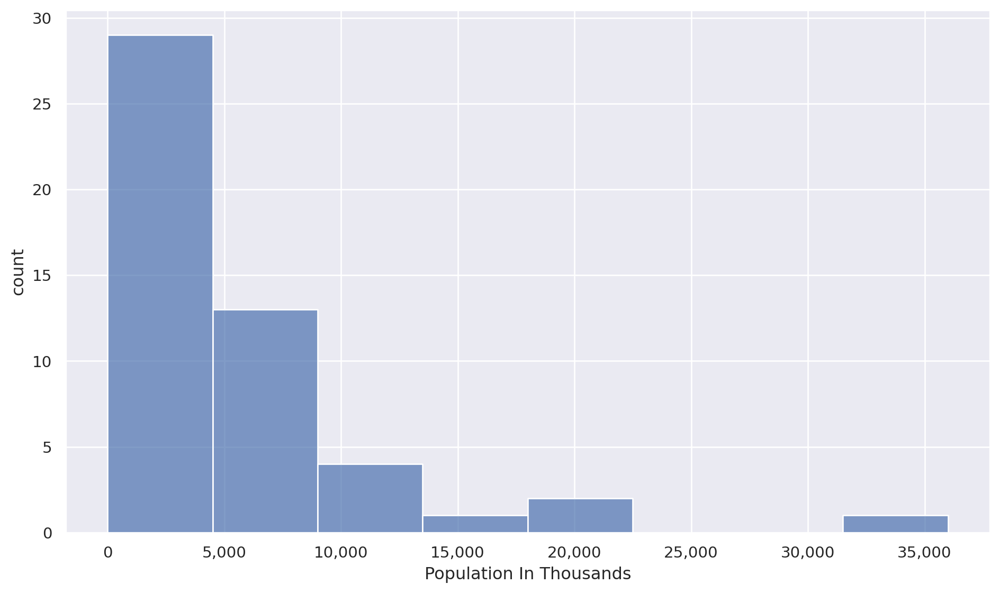

# HW 5 - CS 625, Fall 2023

Gopi Oddiraju  
Due: November 08, 2023


### Part 1: Create Distribution Charts

I've chosen dataset 1 for this Homework. I have manipulated the given data to some extent for convenience. At first, I removed the header and footnotes. I deleted the rows that showed the population for the U.S., Northeast, Midwest, South, and West regions along the District of Columbia. I've deleted the states' codes column and considered only the population of one month in each year. After that, I made a few other minor changes such as formatting the cells. Finally, I saved the file as a CSV format. Both the Original(10s0012.xls) and modified files(10s0012.csv) have been uploaded to this repository. I have read the data from CSV and as data frames using Seaborn. The collab link is provided below. The ipynb file has also been uploaded to the repository.





https://colab.research.google.com/drive/1FvX3loHXZTAs1lfjtsFn2rvbM8wT295g#scrollTo=ynI4XgL2OzAd

```

df_box = pd.melt(df, id_vars=['State'], var_name='Year', value_name='Population In Thousands')

years = ['1980', '2000', '2008']

df_box_filtered = df_box[df_box['Year'].isin(years)]

sns.set(rc={'figure.figsize':(10,6)})

ax = sns.boxplot(data=df_box_filtered, y='Population In Thousands', x='Year',color='purple')

ax.set(ylabel='Population In Thousands')

plt.title('Boxplot showing the distribution of population of all states in 1980,2000, and 2008')

plt.show()


```


After manipulating the data, I've read the saved csv file into a dataframe. Uisng the Pandas melt funtion, I've created a new dataframe that represents a unique combination of 'State' and 'Year', and 'Populaton In Thousands' columns. Created a list of the years for which I'm plotting the chart. Plotted the boxplot for the filtered years. Set appropriate labels for the columns.


By looking at the plot, we can say that the Median line shifts upward as we move from 1980 to 2008. This suggest that the median population increased over years which indicates a potential overall population growth trend. The outliers indicate the states with significantly higher populations than the majorith states.





https://colab.research.google.com/drive/1FvX3loHXZTAs1lfjtsFn2rvbM8wT295g#scrollTo=ynI4XgL2OzAd

```

df_box['Year'] = pd.to_numeric(df_box['Year'], errors='coerce')

sns.set(rc={'figure.figsize':(10, 6)})
ax = sns.ecdfplot(data=df_box[df_box['Year'] == 2000], x='Population In Thousands')

ax.set(xlabel='Population In Thousands')
ax.get_xaxis().set_major_formatter(mpl.ticker.StrMethodFormatter('{x:,.0f}'))
plt.title('eCDF showing the distribution of population in all states in 2000')
plt.show()


```


I've decided to plot an eCDF for the population in the year 2000. The population in the actual file was represented along with commas between numbers. To remove those, I formatted that data as text. When plotting the chart here, I've converted that data again in numeric values. I've Plotted the chart for the filtered data which contains population of the year 2000. I've chose an appropriate size for the chart, and labels for axes and a title for the chart. 


By looking at the plot, we can say that a significant portion of states had a lower populations in 2000 and the gradual slope indicates a more evenly distriuted population. We can identify the percentiles by looking at the 0.25, 0.75 values on y-axis. 0.25 represents the 25th percentile and 0.75 represents the 75th percentile. We can say that 50% of the states had a population below around 5000 thousands in 2000.





https://colab.research.google.com/drive/1FvX3loHXZTAs1lfjtsFn2rvbM8wT295g#scrollTo=ynI4XgL2OzAd

```


(so.Plot(df_box[df_box['Year'] == 2000], 'Population In Thousands')
  .add(so.Bars(), so.Hist(binwidth=4500, binrange=(0, 35000)))
  .label(y="count", x="Population In Thousands")
  .scale(x=so.Continuous().label(like="{x:,.0f}"), y=so.Continuous().label(like="{x:,.0f}"))
  .layout(size=(10, 6))
)


```


I've decide to plot a Histogram for the population in the year 2000. I've Plotted the chart for the filtered data which contains population of the year 2000. I've chose an appropriate size for the chart, and labels for axes. I've considered multiple rules while deciding the binwidth. I've looked at Scott's Rule, Sturges' Rule, Square Root Rule, and Rice Rule all of which suggests that 7 or 8 bins would be optimal choice for this dataset. Based on the number of bins, I've chosen a binwidth of 4500.


By looking at the Histogram, we can say that the high count in the lower bins indicates that many states had relatively smaller populations in 2000. a significant portion of states had a lower populations in 2000. There are a few states with higher populations in the range of 20000 to 35000. These states stand out as outliers compared to the majority of the states with smaller populations. These may be indicative of states with metropolitan cities.


### Part 1: Further Analysis


I've decided to plot a bar chart to represent the population distriution by State in the year 2000. 


The bar chart illustrates the wide variation in state populations in the year 2000. Some states have significantly larger populations, while others have smaller populations. By focusing on a specific year and using a bar chart, we can quickly identify the states with the highest and lowest populations in 2000. This prompts further investigation into the factors contributing to these population differences, such as economic opportunities, geographical features, or historical trends. 


Identifying Outliers:

By examining boxplots of population distribution over the years, it was observed that certain states consistently appeared as outliers, having significantly higher or lower populations than the majority. Boxplots are effective in highlighting outliers, which are data points significantly different from the majority. The presence of outliers prompted further investigation into the factors contributing to the exceptional populations in these states. For example, economic opportunities, urbanization, or unique historical events might be influencing these outliers.
