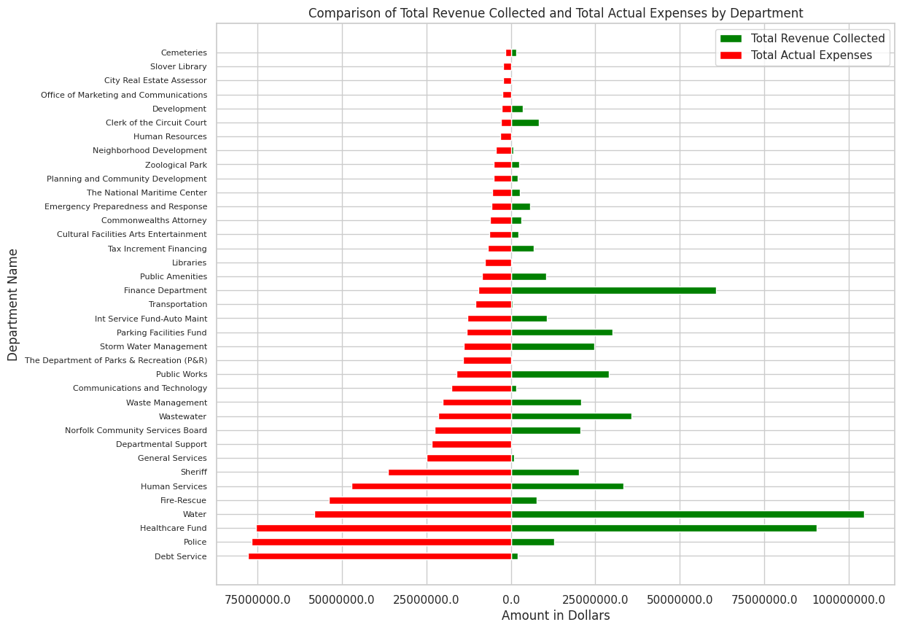

# Semester Project - CS 625, Fall 2023

Gopi Oddiraju  
Due: December 11, 2023


I'm interested in learning more about Norfolk's financial management, particularly across departments. It's fascinating to see revenue and expenditure details for various departments. I find this dataset intriguing because it provides a glimpse into the financial dynamics of the city by demonstrating how various departments manage their budgets, allocate resources, and compensate their employees. By examining how income, expenses, and salaries interact, we can find trends and potential areas for optimization for financial management.


### Dataset:

I have selected some datasets from the Norfolk Open Data website. The Annual Revenues dataset provides information about the city's various revenue resources. This dataset also contains current budget information based on the revenue budget adopted by the City Council ahead of each fiscal year. The Annual Expenditures dataset provides information about the expenses of each department. Both datasets contain data from the current fiscal year and two previous fiscal years. The third dataset, Employee Salaries provides base salary information about the City of Norfolk employees.

Links to these datasets are included below.

Norfolk Open Data: https://data.norfolk.gov/

Annual Revenues dataset: https://data.norfolk.gov/Government/Annual-Revenues/id3i-2az4

Annual Expenditures dataset: https://data.norfolk.gov/Government/Annual-Expenditures/mdwe-dquf

Employees Salaries dataset: https://data.norfolk.gov/Government/Employee-Salaries/4fsk-z8s8


### Data Cleaning:

The given datasets contain data for three fiscal years 2022,2023 and 2024. I've considered the data from the year 2022 only. I saved the given Excel files as CSV and read them as data frames using Seaborn. I've removed data from a few departments which don't create any revenue such as Norfolk public schools. As not all departments can generate revenue, I've removed a few such departments' data. I grouped the data in each dataset by department and using the aggregate function, calculated the sum of expenditures, revenues, and base salaries. It will be helpful as I'm trying to find the correlation between expenditures and revenues in each department. The datasets have been uploaded to this repository. The collab link is provided below. The ipynb file has also been uploaded to the repository.


https://colab.research.google.com/drive/1prYb6HSgBcTO7MLKgXr483YceqmN52aW


### Questions:

I wanted to answer the below questions through visualization. 

1. Is there a correlation between the total revenue collected and the total actual expenses in all departments, suggesting a relationship between income and expenditure?
Hypothesis: If there's a strong positive correlation, it might signify that the city is effectively utilizing its resources and aligning expenditures with revenue.

2. What is the ratio of recovered costs to the overall budget, and are there specific departments that excel in recovering costs for their services?
Hypothesis: If certain departments consistently show a high ratio, it suggests efficient financial management and cost recovery practices for that particular department.

3. I would also like to combine the third dataset and find out which department consistently pays the highest salaries, and whether is there a correlation between the salary levels and the department's ability to recover its expenditure through revenue sources.
Hypothesis: If there's a department with consistently high salaries and a positive correlation between salary levels and expenditure recovery, it suggests that the higher salaries are justified by the department's ability to generate revenue. However, if the correlation is negative or weak, it may indicate a need for the department to reassess its salary structure in relation to revenue recovery.


### Q1:

To be able to answer my question 1, I decided to plot a scatter plot with Total revenue collected on the X-axis and total actual expenses by each department on the Y-axis. I decided not to use color to differentiate among the various departments as I've planned to plot a diverging bar chart to compare the expenses and revenues by each department. This scatter plot is to find if there is any positive correlation between the expenses and revenue. 


https://colab.research.google.com/drive/1prYb6HSgBcTO7MLKgXr483YceqmN52aW


### Visualization Idiom

Idiom: Scatter Plot / Mark: Point
| Data: Attribute | Data: Attribute Type  | Encode: Channel | 
| --- |---| --- |
| Total revenue collected | value, quantitative | horizontal position on a common scale (x-axis) |
| Total actual expenses | value, quantitative | vertical position on a common scale (y-axis) |


```
import matplotlib.pyplot as plt
import seaborn as sns


merged_df = pd.merge(sum_expenses_per_department, sum_revenues_per_department, on=['Fiscal Year', 'Department Name'], how='inner')
merged_df.head()
sns.set(style="whitegrid")
plt.figure(figsize=(12, 8))

# Scatter plot
sns.scatterplot(x="Total Collected", y="Actual Expenses", data=merged_df)
plt.xlabel("Total Revenue Collected")
plt.ylabel("Total Actual Expenses")
plt.title("Correlation between Revenue and Expenditures by Department")

# Formatting the axis labels
plt.gca().xaxis.set_major_formatter(mtick.StrMethodFormatter('${x:,.0f}'))
plt.gca().yaxis.set_major_formatter(mtick.StrMethodFormatter('${x:,.0f}'))
plt.show()
```


From the above scatterplot, It is evident that apart from a few departments with low expenditure and revenue, there is no positive correlation between the expenses and revenues in each department. 


I've also plotted a diverging bar chart to compare the expenses and revenues of each department. I've taken the amount(in dollars) on the X-axis and the department name on the Y-axis. I chose the green color to represent the total revenue collected by each department, the red color to represent the actual expenses by each department, and the length of the bar to represent the amount. 





https://colab.research.google.com/drive/1prYb6HSgBcTO7MLKgXr483YceqmN52aW


### Idiom: Diverging Bar Chart / Mark: Bar

| Data: Attribute | Data: Attribute Type  | Encode: Channel |
| --- |---| --- |
| Amount in Dollars | value, Quantitative | horizontal spatial region (x-axis) |
| Department Name | key, categorical | vertical position on a common scale (y-axis) |
| Financial Activities | key, categorical | Hue (differentiating multiple causes) |


```
import matplotlib.pyplot as plt
import seaborn as sns

sorted_by_expenses = merged_df.sort_values(by='Actual Expenses', ascending=False)

fig, ax = plt.subplots(figsize=(12, 10))
bars_revenue = ax.barh(sorted_by_expenses['Department Name'], sorted_by_expenses['Total Collected'], color='green', height=0.5, label='Total Revenue Collected')
bars_expenses = ax.barh(sorted_by_expenses['Department Name'], -sorted_by_expenses['Actual Expenses'], color='red', height=0.5, label='Total Actual Expenses')

ax.set_xlabel('Amount in Dollars')
ax.set_ylabel('Department Name')
ax.set_title('Comparison of Total Revenue Collected and Total Actual Expenses by Department')
plt.gca().xaxis.set_major_formatter(mtick.StrMethodFormatter('${x:,.0f}'))


ax.legend()
ax.set_xticklabels([abs(x) for x in ax.get_xticks()])
plt.yticks(fontsize=8)
plt.show()

```


From the above diverging bar chart, we can say that the finance department has earned a revenue of more than 50 million dollars whereas its expenses are just around 10 million dollars. Police and Debt Service departments had expenses of around 75 million dollars but were able to collect revenue under 10 million dollars only.


### Q2:

To answer my question 2, I plotted a horizontal bar chart with recovery efficiency ( ratio of recovered costs to actual expenses) on the X-axis and department on the Y-axis. 


https://colab.research.google.com/drive/1prYb6HSgBcTO7MLKgXr483YceqmN52aW


### Idiom: Bar Chart / Mark: Bar
| Data: Attribute | Data: Attribute Type  | Encode: Channel | 
| --- |---| --- |
| Recovery Efficiency | value, Quantitative | horizontal spatial region (x-axis) |
| Department | key, categorical | vertical position on a common scale (y-axis) |


```
import matplotlib.pyplot as plt
import seaborn as sns

merged_df['Recovery Efficiency'] = merged_df['Total Collected'] / merged_df['Actual Expenses']
sorted_departments = merged_df.sort_values(by='Recovery Efficiency', ascending=False)

plt.figure(figsize=(12, 8))
sns.barplot(x='Recovery Efficiency', y='Department Name', data=sorted_departments, palette='viridis')

plt.xlabel('Recovery Efficiency (Recovered Costs / Actual Expenses)')
plt.ylabel('Department Name')
plt.title('Cost Recovery Efficiency Across Departments')
plt.show()


```
From the above chart, we can conclude that the Finance department has a recovery efficiency of more than 6 which suggests that it has recovered more than 6 times of what it has spent. The clerk of the circuit court is in second place with an efficiency close to 3. We also can observe that most of the departments had an efficiency of less than 1 which shows they were not able to recover the amount they spent.


### Q3:


For the third question, I'm combining the third dataset (Salaries) to find out which department pays the highest salaries and if there is any correlation between the salary levels and the department's revenue collected. I've plotted two charts, a scatter plot to find if there is any correlation between the salaries paid and revenue collected in each department, and a diverging bar chart to compare the salaries and revenues in each department.


https://colab.research.google.com/drive/1prYb6HSgBcTO7MLKgXr483YceqmN52aW


### Visualization Idiom

Idiom: Scatter Plot / Mark: Point
| Data: Attribute | Data: Attribute Type  | Encode: Channel | 
| --- |---| --- |
| Base salary | value, quantitative | horizontal position on a common scale (x-axis) |
| Total revenue collected | value, quantitative | vertical position on a common scale (y-axis) |


```

final_dataset = pd.merge(merged_df, sum_salaries_per_department, on=['Department Name'], how='inner')
final_dataset.head()

plt.figure(figsize=(12, 8))
sns.scatterplot(x="Base Salary", y="Total Collected", data=final_dataset)
plt.xlabel("Base Salary")
plt.ylabel("Total Revenue Collected")
plt.title("Correlation between Salary Levels and Revenue Collected by Department")
plt.gca().xaxis.set_major_formatter(mtick.StrMethodFormatter('${x:,.0f}'))
plt.gca().yaxis.set_major_formatter(mtick.StrMethodFormatter('${x:,.0f}'))
plt.show()
```


We can observe that there was no correlation apart from one or two departments where they are paying justified salaries according to the revenue they have collected.


A diverging bar chart was plotted to compare the same with the Amount in dollars on the X-axis and the department on the Y-axis. I chose the green color to represent the total revenue collected by each department, the red color to represent the total base salaries paid by each department, and the length of the bar to represent the amount. 


https://colab.research.google.com/drive/1prYb6HSgBcTO7MLKgXr483YceqmN52aW


### Idiom: Diverging Bar Chart / Mark: Bar

| Data: Attribute | Data: Attribute Type  | Encode: Channel |
| --- |---| --- |
| Amount in Dollars | value, Quantitative | horizontal spatial region (x-axis) |
| Department Name | key, categorical | vertical position on a common scale (y-axis) |
| Financial Activities | key, categorical | Hue (differentiating multiple causes) |


```
import matplotlib.pyplot as plt
import seaborn as sns

sorted_by_salaries = final_dataset.sort_values(by='Base Salary', ascending=False)

fig, ax = plt.subplots(figsize=(12, 10))
bars_revenue = ax.barh(sorted_by_salaries['Department Name'], sorted_by_salaries['Total Collected'], color='green', height=0.5, label='Total Revenue Collected')
bars_salaries = ax.barh(sorted_by_salaries['Department Name'], -sorted_by_salaries['Base Salary'], color='red', height=0.5, label='Total Base Salaries')

ax.set_xlabel('Amount in Dollars')
ax.set_ylabel('Department Name')
ax.set_title('Comparison of Total Revenue Collected and Base Salary by Department')
plt.gca().xaxis.set_major_formatter(mtick.StrMethodFormatter('${x:,.0f}'))

ax.legend()
ax.set_xticklabels([abs(x) for x in ax.get_xticks()])
plt.yticks(fontsize=8)
plt.show()

```


From the chart, It is observed that the Police and Fire-Rescue departments were paying the highest salaries despite their inability to collect higher revenues. Departments such as Human Services, Public Works, and Norfolk Community Service board were able to collect better revenues but chose to spend less than half of the amount that they could collect.


### Final Thoughts:

While our analysis reveals a weak correlation between expenditures and revenues within each department, it would be premature to assume Norfolk's financial management is poor. The comparison is intra-departmental, and it does not consider the possibility that the government allocates revenues from one department to support activities across others. To assess overall financial management, we must consider the implementation of various schemes and initiatives, as they can provide a better understanding of the city's financial strategy.


## References:


https://s3.amazonaws.com/assets.datacamp.com/blog_assets/Python_Seaborn_Cheat_Sheet.pdf
https://towardsdatascience.com/pandas-groupby-aggregate-transform-filter-c95ba3444bbb
https://seaborn.pydata.org/generated/seaborn.scatterplot.html#seaborn-scatterplot
